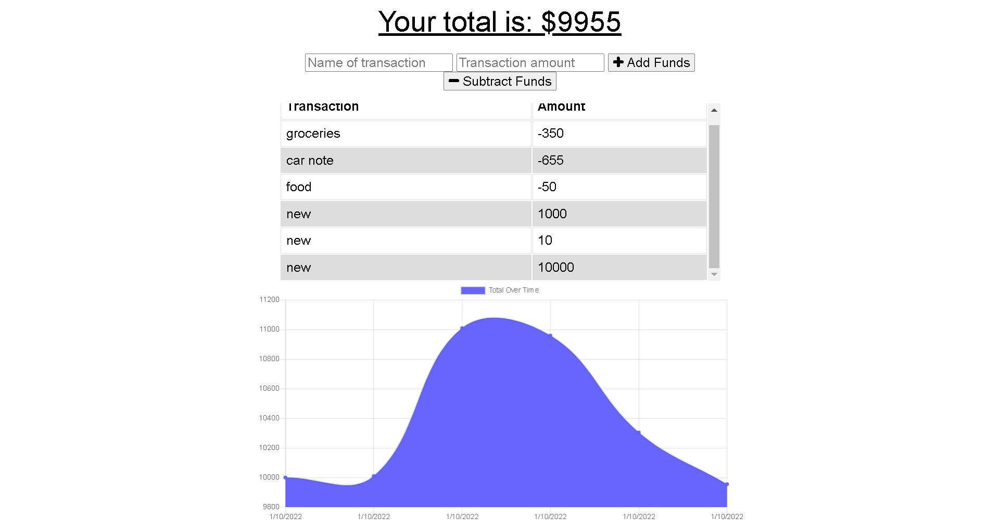

<h1> Tracking-Budgets </h1>

  

## Table of Contents 

- [Description](#description)
- [Screenshot](#screenshot)
- [Features](#features)
- [Deployed](#deployed)
- [Technologies](#technologies)
- [License](#license)
- [Questions](#questions)

 

## Description

### A budget tracker application to allow for offline access and functionality. The budget tracker has a server and uses MongoDB as its database, so you’ll need to deploy this application to Heroku using MongoDB Atlas.

 

## Screenshot

 

# Deployed:

https://trackingbudgets.herokuapp.com/

 

## Features:
- [x] Add a new budget
- [x] Add a new category
- [x] Add a new transaction
- [x] View all budgets
- [x] View all categories
- [x] View all transactions
- [x] View all transactions for a specific budget
- [x] View all transactions for a specific category
- [x] View all transactions for a specific budget and category
- [x] View all transactions for a specific budget and category and date range
- [x] View all transactions for a specific budget and date range
- [x] View all transactions for a specific category and date range
- [x] View all transactions for a specific budget, category and date range

 

## Technologies:
- [React](https://reactjs.org/)
- [React-Router](https://reacttraining.com/react-router/web/guides/quick-start)
- [Redux](https://redux.js.org/)
- [Material-UI](https://material-ui.com/)
- [Firebase](https://firebase.google.com/)
- [Express](https://expressjs.com/)
- [Node.js](https://nodejs.org/)
- [MongoDB](https://www.mongodb.com/)
- [Jest](https://jestjs.io/)
- [Enzyme](https://enzymejs.github.io/)
- [Chai](https://www.chaijs.com/)
- [Mocha](https://mochajs.org/)
- [Webpack](https://webpack.js.org/)
- [Babel](https://babeljs.io/)
- [Git](https://git-scm.com/)

 

## License

This project is licensed under the MIT license. 

 

## Questions?

If you have any questions, contact me at: 
tony.huertinez@gmail.com   
Check out my other work at GitHUb:
[antoniohuerta](https://github.com/Tonycodesnow)  